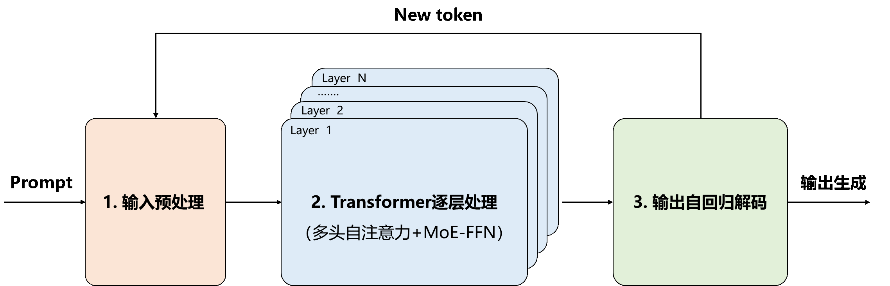

# DeepSeek Technical Principles

The complete lifecycle of large models consists of five stages: **data acquisition**, **data preprocessing**, **model training**, **model fine-tuning**, and **model inference**. Before training begins, massive amounts of multimodal data must be collected - often hundreds of billions of small files requiring several TB or even dozens of TB of storage. This data is typically disorganized, potentially containing duplicates or advertisements, necessitating preprocessing to standardize formats. All data is then fed into the model, and through massive computational power, a foundational large model is trained. To adapt this base model for specific scenarios, it undergoes secondary training with domain-specific data (fine-tuning). Finally, users input prompts to the trained model, which processes them and outputs results through model inference.


# 1. Model Inference

## 1.1 Autoregressive Large Model Inference

Autoregressive models employ sequential generation where each output element depends on previously generated content. Based on Transformer decoder architecture with self-attention mechanisms, these models only attend to already generated positions (e.g., GPT series, LLaMA series, DeepSeek series). Autoregressive inference comprises two phases:

### 1.1.1 Prefill Phase

Generates the first output token from input tokens while caching KV (Key-Value) matrices.

Prefill phase is **compute-intensive**, with computational requirements growing superlinearly with input length.

### 1.1.2 Decode Phase

Generates tokens autoregressively one at a time, updating token sequences and KV Cache until a stop token appears.

Decode phase processes only one token per batch (serial execution), making it **memory-bound (due to memory bandwidth bottlenecks)**, with sublinear computational growth relative to batch size.

## 1.2 DeepSeek R1 Inference Process

Focusing on **inference stage**, DeepSeek R1 uses **sparse MoE-Transformer architecture** combined with **supervised fine-tuning and reinforcement learning**, excelling in logical/mathematical reasoning with 128k token context support. The Prefill/Decode phases involve:



### 1.2.1 Input Preprocessing

(1). **Prompt**: User input (e.g., "What's 2+3?")
(2). **Tokenization**: Splits prompt into tokens (e.g., ["What","'s","2","+","3","?"], length $n=6$), adding control tokens (<BOS>/<EOS>)
(3). **Embedding**: Maps tokens to vectors via embedding matrix $W_{embed} \in \mathbb{R}^{V \times d}$:
   - Vocabulary size $V$ (129280 for DeepSeek R1)
   - Hidden dimension $d$ (4096 for DeepSeek R1)

   1). Assigns unique integer IDs per token using vocabulary:
      *(Vocabulary construction: Built during training via BPE algorithm, merging frequent character pairs iteratively. Includes full words, subwords, punctuation, and special tokens like <BOS>/<EOS>)*
   
   2). Vector lookup via static embedding matrix:
      $$\mathbf{x_i} = \mathbf{W}_{embed}[ID,:] \in \mathbb{R}^{1 \times d}$$

      1dsfsa
      
      Yielding input matrix $\mathbf{X} = [\mathbf{x_1}, \mathbf{x_2}, \cdots, \mathbf{x_8}] \in \mathbb{R}^{n \times d}$
   *(Note: Original prompts can be reconstructed from embeddings via brute-force search)*  
   *(Question: Is positional encoding directly added to embeddings?)*

### 1.2.2 Transformer Layer Processing


For $N=64$ layers (each with MHSA and MoE-FFN), first layer operations:

(1). **Norm**: Normalizes input vectors $\mathbf{x_i}$ via RMS scaling:
    <div align="center">
      $$\mathbf{X}_{n \times d} = \begin{bmatrix}
   \mathbf{x_1} \\ \mathbf{x_2} \\ \vdots \\ \mathbf{x_n}
   \end{bmatrix} = \begin{bmatrix}
   x_{1,1} & \cdots & x_{1,d} \\
   \vdots & \ddots & \vdots \\
   x_{n,1} & \cdots & x_{n,d}
   \end{bmatrix}$$
   </div>

(2). **Self-Attention**: Computes Query/Key/Value matrices:
   <div align="center">
     $$\mathbf{Q} = \mathbf{XW}^Q, \mathbf{K} = \mathbf{XW}^K, \mathbf{V} = \mathbf{XW}^V \in \mathbb{R}^{n \times d_k}$$
     </div>
   where $\mathbf{W}^{Q/K/V} \in \mathbb{R}^{d \times d_k}$, $d_k = d/h$ ($h$=attention heads)

   *(Why cache K/V not Q? - KV Cache)*

   Attention weights:
   <div align="center">
   $$\text{Attention}(\mathbf{Q,K,V}) = \text{Softmax}\left(\frac{\mathbf{QK}^T}{\sqrt{d_k}}\right)\mathbf{V}$$
   </div>

(3). **Multi-Head Attention** (128 heads in DeepSeek R1):
<div align="center">
   $$head_i = \text{Attention}(\mathbf{Q}_i,\mathbf{K}_i,\mathbf{V}_i)$$
 </div>
  <div align="center">
   $$\text{MultiHead}(Q,K,V) = \text{Concat}(head_1,...,head_{128})\mathbf{W}^O$$
 </div>
(4). **Add**: Residual connection stabilizes training:
  <div align="center">
   $$\mathbf{x_i'} = \mathbf{x_i} + \text{MultiHead}_i(Q,K,V)$$
    </div>

(5). **MoE-FFN**: Sparse-activated experts ($E$ total):
   - Expert computation ($d_f$=18432 in DeepSeek V3):
     <div align="center">
     $$E_j(\mathbf{x_i'}) = \text{GeLU}(\mathbf{x_i'W}_j^{(1)})\mathbf{W}_j^{(2)}$$
     </div>
   - Gating network (top-$k$ experts, $k=2$):
     <div align="center">
     $$g_j = \text{Softmax}(\mathbf{x_i'W}_g + \epsilon)$$
     </div>
   - Weighted sum:
     <div align="center">
     $$\mathbf{y_i} = \sum_{j=1}^E g_j(\mathbf{x_i'}) \cdot E_j(\mathbf{x_i'})$$
     </div>

(6). Final output after $N$ layers: $\mathbf{x_n} \in \mathbb{R}^{1 \times d}$

### 1.2.3 Autoregressive Decoding

(1). **LM Head**: Projects to vocabulary space:
      <div align="center">
      $$\text{logits} = \mathbf{x_nW}_ {logits }, \quad \mathbf{W}_{logits} \in \mathbb{R}^{d \times V}$$
      </div>
      <div align="center">
      $$p = \text{Softmax}(\text{logits})$$
      </div>

(2). **Sampling**: Defaults to Top-$p$ sampling. Alternatives:
   - Greedy search (highest probability token)
   - Top-$k$ sampling (renormalize top $k$ tokens)

Example: Input ["What","'s","2","+","3","?"] → Output "5" → [...] → <EOS>

# 2. Model Architecture

## 2.1 DeepSeek R1-1.5B


## 2.2 DeepSeek R1-32B


# 3. vLLM Deployment Example

## Server Command:
```bash
CUDA_VISIBLE_DEVICES=0,1,2,3,4,5,6,7 vllm serve /data/model/deepseek-r1-32b \
--port 5000 --max-model-len 2048 \
--gpu-memory-utilization 0.8 --tensor-parallel-size 8
```

## Client Command:
 client.py
